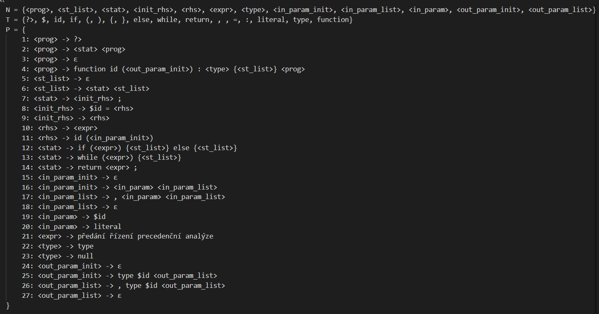
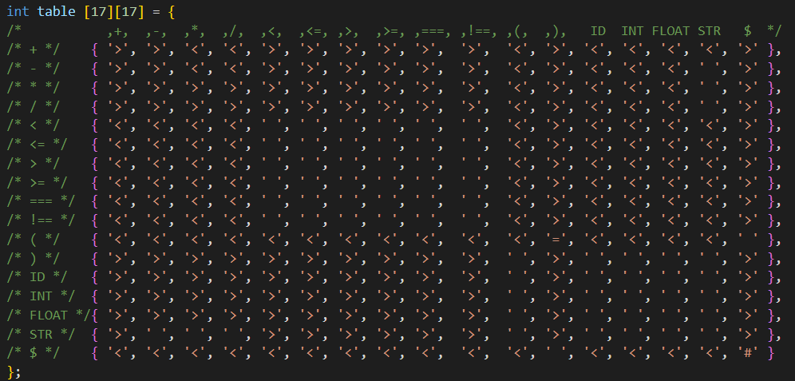

> FAKULTA INFORMAČNÍCH TECHNOLOGIÍ VYSOKÉ UČENÍ TECHNICKÉ V BRNĚ
>
> {width="4.25in"
> height="1.926388888888889in"}
>
> Projektová dokumentace
>
> **Implementace překladače imperativního** **jazyka IFJ22**\
> Tým xproch0q varianta I BVS

+-----------------+-----------------+-----------------+-----------------+
| 7\. prosince    | Vojtěch Adámek  | > (xadame44)    | > 25 %\         |
| 2022            |                 |                 | > 25 %\         |
|                 |                 |                 | > 25 % 25 %     |
+=================+=================+=================+=================+
|                 | Tomáš Najman    | > (xnajma03)    |                 |
+-----------------+-----------------+-----------------+-----------------+
|                 | Jan Osuský      | > (xosusk00)    |                 |
+-----------------+-----------------+-----------------+-----------------+
|                 | > **David       |                 |                 |
|                 | > Procházka     |                 |                 |
|                 | > (xproch0q)**  |                 |                 |
+-----------------+-----------------+-----------------+-----------------+

**Úvod**

> Cílem projektu bylo naprogramovat program v jazyce C, který načte
> zdrojový kód
>
> zapsaný ve zdrojovém jazyce IFJ22 a přeloží jej do cílového jazyka
> IFJcode22
>
> (mezikód). Jestliže proběhne celý překlad bez chyb, vrací se návratová
> hodnota „0".

**Implementace**

> Popis implementací jednotlivých částí potřebných a celkové
> funkcionalitě
>
> **Lexikální analýza**\
> První částí překladače je **scanner**, který načítá a „zjišťuje"
> jednotlivé **lexémy** a předává je **parseru** v podobě tokenů.
> Scanner byl implenetován podle předem vytvořeného diagramu
> deterministického konečného automatu bez **epsilon** přechodů. Diagram
> automatu najdete na konci dokumentace obrázek 1.
>
> Scanner je implementován v souborech **scanner.c** a v hlavičce
> **scanner.h**. Hlavní funkcí t[é]{.underline}to části je
> **get_token(lexToken \*token)**, kde se neustále načítají znaky ze
> standardního vstupu pomocí funkce **getchar()**. Konečný automat je
> implementován, jako jednoduchý **switch**, kde každý případ je jeden
> stav KA. Konečné stavy jsou definovány v hlavičce jako makra pomocí
> #define**.**
>
> Scanner zapíše řetězec tokenu do struktury **lexToken**. V případě
> chyby se vrátí
>
> odpovídající **ERROR_CODE** **(číslo)**, podle chyby při načítání nebo
>
> **ERROR_NO_ERROR** v případě úspěchu.
>
> **Syntaktická analýza**\
> Druhá a nejdůležitější část překladače je implementována v souborech
> **parser.c** a v hlavičce **parser.h**. **Parser** řídí celý průběh
> překladu a je brán jako kostra.
>
> Syntaktická analýza se řídí vytvořenou LL-gramatikou a metodou
> rekurzivního
>
> sestupu (zhora dolů). Každému pravidlu v naší vytvořené LL-gramatice
> odpovídá jedna
>
> funkce v **parser.c**. Naše LL-gramatika je na konci dokumentace
> obrázek 2 a 3.
>
> Hlavní funkcí **parseru** je funkce **parser()** volaná v souboru
> **main.c**. Načte se první token a podle kontroly prvního pravidla se
> volají další funkce na kontrolu pravidel. Celý **parser** dále funguje
> rekurzivně. Pro načtení nových tokenů se používá definované makro
> **GET_NEXT_TOKEN**.
>
> Když **parser** při kontrole pravidel zjistí chybu, tak vrátí
> **ERROR_BAD_SYNTAX**, jinak vrací hodnotu **ERROR_NO_ERROR**, což je
> hodnota 0.
>
> Když **parser** dojde k výrazu, zavolá se funkce na precedenční
> analýzu **analyze(&ParserData)**, kde se předá celá struktura
> **ParserData.**
>
> **Sémantická analýza**
>
> Sémantická analýza probíhá souběžně se syntaktickou analýzou. Pomocí
> tabulky
>
> symbolů, která je implementována jako binární vyhledávací strom a má
> pomocné
>
> funkce, se kontroluje, zda byly funkce a proměnné definovány, tyto
> funkce si sám volá

2

> **parser**. Kontrola proměnných probíhá v **parseru** za pomocí
> tabulky symbolů pro proměnné a kontrola funkcí stejně.

**Zpracování výrazů**\
Výrazy jsou analyzovány odděleně v souborech **precanal.c** av hlavičce
**precanal.h**. Hlavní funkcí je**analyze(ParserData \*data)**, kterou
si volá **parser**. Funkce si načte první token a v případě úspěchu
vrátí číslo 0, jinak vrací číslo **ERROR** odpovídající zjištěné chybě.
Zpracování výrazů probíhá pomocí precedenční analýzy (zdola nahoru).
Nový token je porovnán s tokenem na vrcholu vytvořeného zásobníku, kde
na začátku je do něj vložen znak dolaru, a podle precedenční tabulky
**table** je umístěn na zásobník, nebo je výraz zpracován podle pravidel
v rámci funkce **reduce**. Precedenční tabulka je na konci dokumentace
obrázek 4.

> **Hodnoty v tabulce:**
>
> 1.'\<' znamená, že načtený znak je přidán na zásobník (funkce
> **shift**)

2.'\>' znamená, že se uplatní pravidlo voláním funkce **reduce**

> 3.'=' znamená, že se redukují závorky
>
> 4.' ' sémantická chyba
>
> 5.'#' úspěšný návrat
>
> **Generátor kódu**
>
> **Abstraktní datové struktury**

Popis použitých datových struktur

> **Tabulka symbolů**\
> Tabulku symbolů jsme řešili formou rekurzivního binárního
> vyhledávacího stromu.

Rekurzivní implementaci jsme zvolili pro její jednoduchost, která nám
umožnila rychlé

programování základních operací nad binárním stromem, díky čemuž jsme se
mohli dříve

věnovat složitějším problémům.

> Tabulka je rozdělená na dvě části: tabulka symbolů pro funkce a
> tabulka symbolů pro

proměnné. Jedna instance tabulky symbolů pro proměnné je použita pro
hlavní tělo programu. Ostatní lokální tabulky proměnných (např. pro
proměnné ve funkcích) jsou pak uspořádány na

zásobníku tabulek symbolů pro proměnné. Díky zásobníku lze určovat,
kterou proměnnou

použít při zanořování.

> **Tabulka symbolů pro proměnné**\
> Uchovává následující informace:

+-----------------------------------+-----------------------------------+
| > •\                              | > název proměnné\                 |
| > •\                              | > datový typ\                     |
| > •\                              | > zdali může obsahovat NULL       |
| > •                               | > definice proměnné               |
+===================================+===================================+
+-----------------------------------+-----------------------------------+

3

> **Tabulka symbolů pro funkce**\
> Uchovává následující informace:\
> • název funkce\
> • počet parametrů\
> • seznam parametrů\
> • definice funkce\
> • návratová hodnota
>
> **Zásobník pro práci s výrazy**\
> Zásobník je implementován v souborech **precstack.c** a
> **precstack.h**.

Do zásobníku se ukládá struktura **prec_elem_t** datový typ tokenu a
jestli je to terminál. Pro zásobník jsou implementovány funkce jako
**init, push, pop, free**.

> **Vázaný seznam pro generátor**

**Dynamický řetězec**\
Struktura se využívá pro uchování řetězce tokenu, obsahuje délku atd.
Pro řetězec jsou implementovány funkce jako **dynStrInit, addChar**.

**Testování**

Testování probíhalo manuálně po celou dobu vývoje.

**Práce v týmu**

> Tým jsme vytvořili přes Discord, převážně jsme se ale znali z týmu z
> minulého roku. Na

komunikaci jsme používali Discord a Messenger. Na schůzkách ve škole,
jsme se vždy jen domlouvali, co je potřeba udělat, jak by mělo, co
fungovat a zadávali jsme si termíny. Termíny

jsme měli rozepsané také na Microsoft Planneru. Některé části řešil
každý člen sám, u těžších částí jsme si navzájem pomáhali. Ke konci
odevzdání jsme využívali nejvíce Discord pro hovory a sdílení obrazovek.

> **Sdílení kódu**\
> Využili jsme technologií, které nabízí GitHub. Tím pádem se nám
> upravování sdíleného kódu zjednodušilo. Programovali jsme ve Visual
> Studio Code a Sublime.

4

**Rozdělení práce**

+-----------------------------------+-----------------------------------+
| > Člen                            | > Práce na projektu               |
+===================================+===================================+
| > Vojtěch Adámek                  | > Parser, Prec. analýza, Tabulka  |
|                                   | > symbolů                         |
+-----------------------------------+-----------------------------------+
| > Tomáš Najman                    | > Prec. analýza, zásobník,        |
|                                   | > Dokumentace                     |
+-----------------------------------+-----------------------------------+
| > Jan Osuský                      | > Parser, LL-gramatika            |
+-----------------------------------+-----------------------------------+
| **David Procházka**               | > Vedoucí týmu, LL-gramatika,     |
|                                   | > Scanner, Parser, KA             |
+-----------------------------------+-----------------------------------+

**Závěr**

Projekt byl rozsáhlý, ale snažili jsme se využít všechny naše dovednosti
i z jiných předmětů na škole. Projekt nám dal cenné zkušenosti v rámci
programování, práce v týmu a domluvy, a hlavně rozvržení času pro
budoucí velké projekty.

> **Diagram konečného automatu**

{width="6.301388888888889in"
height="4.588888888888889in"}

*konečný automat přijímající jazyk IFJ22 obr. 1*

5

**LL-gramatika**

{width="6.301388888888889in"
height="3.3in"}

*LL-gramatika seznam pravidel obr. 2*

{width="6.301388888888889in"
height="2.85in"}

*LL-gramatika seznam pravidel obr. 3*

6

> **Tabulka pro precedenční analýzu**

{width="6.301388888888889in"
height="3.0166666666666666in"}

*tabulka pro správnou funkcionalitu precedenční analýzy obr. 4*

7
